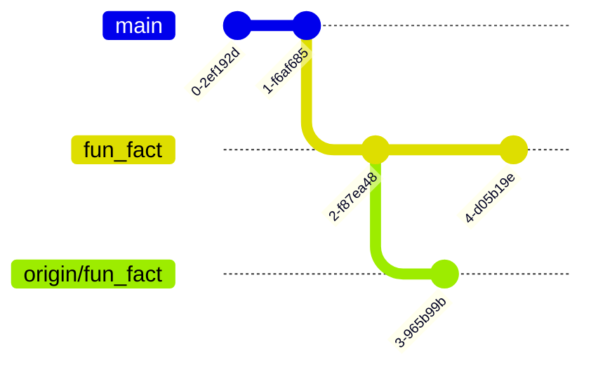

+++{"lesson_part": "main"}

# How do git branches work?

Today we are going to work with branches offline to begin to understand them better. 


+++{"lesson_part": "main"}
## Git cheatsheets

High quality, correct refrences are important to gaining an understanding and being able to use tools well. 


+++{"lesson_part": "site"}
```{important}
Checking for factual information is not reliable in LLMs. They can be a helpful coding assistant when you know what you want, but they generate text that has not been fact checked. Using trusted sources will help you. 
```

+++{"lesson_part": "main"}

- [visual cheatsheet](https://ndpsoftware.com/git-cheatsheet.html#loc=index;)
- [github cheatsheet in many languages](https://training.github.com/)
- [complete official docs](https://git-scm.com/docs)

We are going to work between the browser and locally in order to simulate scenarios that most often occur in collaboration, but can also occur working alone as well. 


+++{"lesson_part": "main"}

## Back to the gh-inclass repo

Recall, We can move around and examine the computer's file structure using shell commands.

Open a new terminal window and navigate to your folder for the course (the one that contains other folders)
+++{"lesson_part": "main"}

```{code-cell} bash
:tags: ["skip-execution"]
cd Documents/inclass/systems/gh-inclass-sp26-brownsarahm/
```


+++{"lesson_part": "main"}


To confirm our current working directory we print it with `pwd`
```{code-cell} bash
:tags: ["skip-execution"]
pwd
```

+++{"lesson_part": "main","type":"output"}

```{code-block} console
/Users/brownsarahm/Documents/inclass/systems/gh-inclass-sp26-brownsarahm
```

+++{"lesson_part": "main"}

next, we check in with git
```{code-cell} bash
:tags: ["skip-execution"]
git status
```

+++{"lesson_part": "main","type":"output"}

```{code-block} console
:label: aheadoforigin
On branch 2-create-an-about-file
Your branch is ahead of 'origin/2-create-an-about-file' by 1 commit.
  (use "git push" to publish your local commits)

nothing to commit, working tree clean
```


First, we talked about this a bit in lab, but the last step we did not do in class last week was `git push`. 


+++{"lesson_part": "main"}

(fix-fork)=
## Fixing the fork 

the `gh` CLI has some nice features, it gives you access to *GitHub* features (PR, Issues, etc) from the terminal.  Including opening browser windows to a repo. 

We can use it like : 
```{code-cell} bash
:tags: ["skip-execution"]
gh repo view --web
```

+++{"lesson_part": "main","type":"output"}

```{code-block} console
X No default remote repository has been set. To learn more about the default repository, run: gh repo set-default --help

please run `gh repo set-default` to select a default remote repository.
```

However, the first time you use it in a repo that is a {term}`fork` (all the ones from GitHub classroom are forks) it does not know what URL to go to

+++{"lesson_part": "main"}

It did give us a hint, so we will follow that. 

```{code-cell} bash
:tags: ["skip-execution"]
gh repo set-default compsys-progtools/gh-inclass-sp26-brownsarahm
```
:::::{attention}
Yours should be your username instead of mine
::::::

+++{"lesson_part": "main","type":"output"}

```{code-block} console
✓ Set compsys-progtools/gh-inclass-sp26-brownsarahm as the default repository for the current directory
```

+++{"lesson_part": "main"}

Now we try again to open in the browser

```{code-cell} bash
:tags: ["skip-execution"]
gh repo view --web
```

+++{"lesson_part": "main","type":"output"}

```{code-block} console
Opening https://github.com/compsys-progtools/gh-inclass-sp26-brownsarahm in your browser.
 ```

+++{"lesson_part": "main"}

## Git Branches do not sync automatically

Now again check with git. We have confirmed in browser we do not see the new file, this is what `git status` tells us too. 

```{code-cell} bash
:tags: ["skip-execution"]
git status
```

+++{"lesson_part": "main","type":"output"}

```{code-block} console
On branch 2-create-an-about-file
Your branch is ahead of 'origin/2-create-an-about-file' by 1 commit.
  (use "git push" to publish your local commits)

nothing to commit, working tree clean
```

+++{"lesson_part": "main"}
we do have it locally, though

```{code-cell} bash
:tags: ["skip-execution"]
ls
```

+++{"lesson_part": "main","type":"output"}

```{code-block} console
about.md	README.md
 ```

+++{"lesson_part": "main"}

To send to github, we use `push`

```{code-cell} bash
:tags: ["skip-execution"]
git push
```

+++{"lesson_part": "main","type":"output"}

```{code-block} console
Enumerating objects: 4, done.
Counting objects: 100% (4/4), done.
Delta compression using up to 16 threads
Compressing objects: 100% (2/2), done.
Writing objects: 100% (3/3), 314 bytes | 314.00 KiB/s, done.
Total 3 (delta 0), reused 1 (delta 0), pack-reused 0 (from 0)
To https://github.com/compsys-progtools/gh-inclass-sp26-brownsarahm.git
   67010e3..a254c24  2-create-an-about-file -> 2-create-an-about-file
 ```

In browser, we added our names to the file

+++{"lesson_part": "main"}

The `cat` comand concatenated or appends to the end the contents of a file to the std out (the terminal output).
```{code-cell} bash
:tags: ["skip-execution"]
cat about.md 
```

+++{"lesson_part": "main","type":"output"}

```{code-block} console
```

+++{"lesson_part": "main"}

```{code-cell} bash
:tags: ["skip-execution"]
git pull
```

+++{"lesson_part": "main","type":"output"}

```{code-block} console
remote: Enumerating objects: 3, done.
remote: Counting objects: 100% (3/3), done.
remote: Compressing objects: 100% (2/2), done.
remote: Total 3 (delta 0), reused 0 (delta 0), pack-reused 0 (from 0)
Unpacking objects: 100% (3/3), 957 bytes | 957.00 KiB/s, done.
From https://github.com/compsys-progtools/gh-inclass-sp26-brownsarahm
   a254c24..cfd464d  2-create-an-about-file -> origin/2-create-an-about-file
Updating a254c24..cfd464d
Fast-forward
 about.md | 1 +
 1 file changed, 1 insertion(+)
 ```

+++{"lesson_part": "main"}
Now, after we did `pull` the content is there

```{code-cell} bash
:tags: ["skip-execution"]
cat about.md 
```

+++{"lesson_part": "main","type":"output"}

```{code-block} console
# Sarah
 ```


+++{"lesson_part": "main"}
We made a PR for the about branch and merged it in browser. 

Then in the browser the `about.md` file exists on the main branch. 

+++{"lesson_part": "main"}

Back on our local computer, we will go back to the main branch, using `git checkout`

+++{"lesson_part": "main"}

```{code-cell} bash
:tags: ["skip-execution"]
git checkout main
```

+++{"lesson_part": "main","type":"output"}

```{code-block} console
Switched to branch 'main'
Your branch is up to date with 'origin/main'.
 ```
:::::{warning}
Notice that if we do not pull first after we merge, it does not even know it's out of date
:::::::

+++{"lesson_part": "main"}
now we look at the status of our repo: 
```{code-cell} bash
:tags: ["skip-execution"]
ls
```

+++{"lesson_part": "main","type":"output"}

```{code-block} console
README.md
```

 the file is missing.  It said it was up to date with origin main, but that is the most recent time we checked github only.  It's up to date with our local record of what is on GitHub, not the current GitHub. 


This manual control means that someone can break something in one place and you can fix it from another copy, it is an *advantage* but we have to do a bit of work. 

+++{"lesson_part": "main"}

Next, we will update locally, with `git fetch`


```{code-cell} bash
:tags: ["skip-execution"]
git fetch
```

+++{"lesson_part": "main","type":"output"}

```{code-block} console
remote: Enumerating objects: 1, done.
remote: Counting objects: 100% (1/1), done.
remote: Total 1 (delta 0), reused 0 (delta 0), pack-reused 0 (from 0)
Unpacking objects: 100% (1/1), 913 bytes | 913.00 KiB/s, done.
From https://github.com/compsys-progtools/gh-inclass-sp26-brownsarahm
   67010e3..f6886ba  main       -> origin/main
 ```


+++{"lesson_part": "main"}


Here we see 2 sets of messages.  Some lines start with "remote" and other lines do not. 
The "remote" lines are what `git` on the GitHub server said in response to our request and the 
other lines are what `git` on your local computer said. 

So, here, it counted up the content, and then sent it on GitHub's side. On the local side, it unpacked (remember git compressed the content before we sent it). It describes the changes that were made on the 
GitHub side, the main branch was moved from one commit to another. So it then updates the local main branch accordingly ("Updating 67010e3..f6886ba ").

:::::{important}
The hashes, here `67010e3..f6886ba` will be unique in every project, but that stands for the commits that have been sent from one location to the other
:::::


+++{"lesson_part": "main"}
  
We can see that if this updates the working directory too: 

```{code-cell} bash
:tags: ["skip-execution"]
ls
```

+++{"lesson_part": "main","type":"output"}

```{code-block} console
README.md
```

+++{"lesson_part": "main"}
no changes yet. `fetch` updates the .git directory so that git knows more, but does not update our local file system. 


It tells us the the branch can be fast forwarded, this is one of the ways that branches can be updated from another branch. 

+++{"lesson_part": "main"}

(fastforward)=
### Fast Forward

Before
```{mermaid}
gitGraph
    commit id:"A"
    commit id:"B"
    branch origin/main
    checkout origin/main
    commit id:"C"
    commit id:"D"
```

After:

```{mermaid}
gitGraph
    commit id:"A"
    commit id:"B"
    commit id:"C"
    commit id:"D"
```

Fast forward can only happen where there are stictly more commits on the incoming branch. (here the remote branch that we have fetched)

+++{"lesson_part": "main"}

(rebase)=
### Git Rebase

Rebase changes the {term}`base` commit of a branch. It works by changing the parent of the first commit that is unique to the current branch and then making new versions of the previous commits on the branch. 

(rebase:before)=

::::::{tab-set}
:::::{tab-item} Before
```{mermaid}
gitGraph
    commit id:"D"
    commit id:"E"
    branch topic
    checkout topic
    commit id:"A"
    checkout main
    commit id:"F"
    checkout topic
    commit id:"B"
    checkout main
    commit id:"G"
    checkout topic
    commit id:"C" tag: "head"
```

:::::
:::::{tab-item} After

(rebase:after)=


```{mermaid}
gitGraph
    commit id:"D"
    commit id:"E"
    commit id:"F"
    commit id:"G"
    branch topic
    checkout topic
    commit id:"A-new"
    commit id:"B-new"
    commit id:"C-new" tag: "head"
    checkout main
```

:::::
:::::::

:::::{seealso}
the [rebase docs](https://git-scm.com/docs/git-rebase.html) have a lot more examples (though they're text images)
:::::

+++{"lesson_part": "site"}

### Git Merge

is one the third option for how to handle it, if we choose `--no-rebase` it will use merge. Merge instead adds as new commit that contains all of the changes to the new {term}`base branch`

::::::{margin}
:::{hint}
this is the same as what happens when we merge a PR (but run on the server)
:::
:::::::

```{mermaid}
gitGraph
    commit id:"D"
    commit id:"E"
    branch origin/main
    checkout origin/main
    commit id:"A"
    checkout main
    commit id:"F"
    checkout origin/main
    commit id:"B"
    checkout main
    commit id:"G"
    checkout origin/main
    commit id:"C"
    checkout main
    merge origin/main id:"H (contains A,B,C)"
```


+++{"lesson_part": "main"}

We can use the fast forward option, so we will with `pull`

```{code-cell} bash
:tags: ["skip-execution"]
git pull
```

+++{"lesson_part": "main","type":"output"}

```{code-block} console
Updating 67010e3..f6886ba
Fast-forward
 about.md | 1 +
 1 file changed, 1 insertion(+)
 create mode 100644 about.md
```

This tells us:
- what commit was moved from `67010e3` and to `f6886ba`
- what method was used (`Fast-forward`)
- for each changed file, how many lines were added (and removed, but not here) ` about.md | 1 +`= 3 lines were added to the readme file. 
- a total number of changed files and lines (`1 file changed, 1 insertions(+)`)
- and any created files or folders `create mode 100644 about.md` - the mode says that it is a normal file. 


:::::{exercise}
:label: branch-create

Try each of the following. Figure out what each one does. Check them and be sure of everything it does. 

- `git checkout my_branch_checkedout`
- `git checkout -b my_branch_checkedoutb`
- `git branch create my_branch_created`
- `git branch my_branch; git checkout my_branch`

:::::

:::::{solution} branch-create
:dropdown:

- using `checkout` with a nonexistant branch name causes an error
- `-b` creates a branch
- `create` is not a git command, so it throws an error
- `git branch` creates a new branch, `;` lets us run 2 commands at once, `checkout` switches
::::::

+++{"lesson_part": "main"}

With no options or inputs, `git branch` will list the branches that exist. 

+++{"lesson_part": "main"}

```{code-cell} bash
:tags: ["skip-execution"]
git branch
```

+++{"lesson_part": "main","type":"output"}

```{code-block} console
  2-create-an-about-file
  main
* my_branch
  my_branch_checkedoutb
 ```


+++{"lesson_part": "main"}

## making a new branch locally

We've used `git checkout` to switch branches before.  To also create a branch at the same time, we use the `-b` option. 


+++{"lesson_part": "main"}

```{code-cell} bash
:tags: ["skip-execution"]
git checkout -b fun_fact
```

+++{"lesson_part": "main","type":"output"}

```{code-block} console
Switched to a new branch 'fun_fact'
 ```


+++{"lesson_part": "main"}
we can view the commit history with `git log` 

```{code-cell} bash
:tags: ["skip-execution"]
git log
```


+++{"lesson_part": "main","type":"output"}
(branchesarepointers)=
branches are like pointers, they point to a commit. 

```{code-block} console
commit f6886babaa283a8238632930bf2cca9121fc274b (HEAD -> fun_fact, origin/main, origin/HEAD, my_branch_checkedoutb, my_branch, main)
Merge: 67010e3 cfd464d
Author: Sarah Brown <brownsarahm@uri.edu>
Date:   Tue Feb 3 19:57:53 2026 +0200

    Merge pull request #5 from compsys-progtools/2-create-an-about-file
    
    create empty about

commit cfd464dc22568fcff6aa302fbd6025e44b7262ac (origin/2-create-an-about-file, 2-create-an-about-file)
Author: Sarah Brown <brownsarahm@uri.edu>
Date:   Tue Feb 3 12:52:14 2026 -0500

    Update about.md

commit a254c24301bc02c9624726573e902c8ffe437a0b
Author: Sarah M Brown <brownsarahm@uri.edu>
Date:   Thu Jan 29 13:37:03 2026 -0500

    create empty about

commit 67010e313ae6a25d88b4d704769d1c46e6680d35
Author: github-classroom[bot] <66690702+github-classroom[bot]@users.noreply.github.com>
Date:   Thu Jan 29 17:58:39 2026 +0000

    add online IDE url

commit 3990d7285e7ec3390d9069fda3f37e2231f78664
Author: github-classroom[bot] <66690702+github-classroom[bot]@users.noreply.github.com>
Date:   Thu Jan 29 17:58:35 2026 +0000

    Setting up GitHub Classroom Feedback

commit 05b77103b9878a3b14fb0a2ca58bee76fdf56732 (origin/feedback)
Author: github-classroom[bot] <66690702+github-classroom[bot]@users.noreply.github.com>
Date:   Thu Jan 29 17:58:35 2026 +0000

    GitHub Classroom Feedback

commit 9b61eadc429770d40b30f3a51af3ef69dc843e35
Author: github-classroom[bot] <66690702+github-classroom[bot]@users.noreply.github.com>
Date:   Thu Jan 29 17:15:07 2026 +0000

    Initial commit
 ```

+++{"lesson_part": "main"}

```{code-cell} bash
:tags: ["skip-execution"]
git log
```

+++{"lesson_part": "main","type":"output"}

```{code-block} console
commit f6886babaa283a8238632930bf2cca9121fc274b (HEAD -> fun_fact, origin/main, origin/HEAD, my_branch_checkedoutb, my_branch, main)
Merge: 67010e3 cfd464d
Author: Sarah Brown <brownsarahm@uri.edu>
Date:   Tue Feb 3 19:57:53 2026 +0200

    Merge pull request #5 from compsys-progtools/2-create-an-about-file
    
    create empty about

commit cfd464dc22568fcff6aa302fbd6025e44b7262ac (origin/2-create-an-about-file, 2-create-an-about-file)
Author: Sarah Brown <brownsarahm@uri.edu>
Date:   Tue Feb 3 12:52:14 2026 -0500

    Update about.md

commit a254c24301bc02c9624726573e902c8ffe437a0b
Author: Sarah M Brown <brownsarahm@uri.edu>
Date:   Thu Jan 29 13:37:03 2026 -0500

    create empty about
```

::::::{attention}
to exit the `git log` program, press <kbd>q</kbd>
::::::::::


+++{"lesson_part": "main"}


we can use the [nano text editor](https://www.nano-editor.org/dist/latest/nano.html).  `nano` is simpler than other text editors that tend to be more popular among experts, `vim` and `emacs`.  Getting comfortable with nano will get you used to the ideas, without putting as much burden on your memory.  This will set you up to learn those later, if you need a more powerful terminal text editor. 
+++{"lesson_part": "main"}

```{code-cell} bash
:tags: ["skip-execution"]
nano about.md 
```


this opens the nano program on the terminal.  it displays reminders of the commands at the bottom of th screen and allows you to type into the file right away. 

+++{"lesson_part": "main"}

Add any fun fact on the line below your content.  Then, write out (save), it will prompt the file name.  Since we opened nano with a file name (`about.md`) specified, you will not need to type a new name, but to confirm it, by pressing enter/return. 


+++{"lesson_part": "main"}

```{code-cell} bash
:tags: ["skip-execution"]
cat about.md 
```

+++{"lesson_part": "main","type":"output"}

```{code-block} console
# Sarah

I started at URI in 2020
 ```

+++{"lesson_part": "main"}

```{code-cell} bash
:tags: ["skip-execution"]
git status
```

+++{"lesson_part": "main","type":"output"}

```{code-block} console
On branch fun_fact
Changes not staged for commit:
  (use "git add <file>..." to update what will be committed)
  (use "git restore <file>..." to discard changes in working directory)
	modified:   about.md

no changes added to commit (use "git add" and/or "git commit -a")
 ```


+++{"lesson_part": "main"}

This is very similar to when we checked after creating the file before, but, notice a few things are different.  
- the first line tells us the branch but does not compare to origin. (this branch does not have a linked branch on GitHub)
- thefile is listed as "not staged" instead of untracked
- it gives us the choice to add it to then commit OR to restore it to undo the changes


We will add it to stage

```{code-cell} bash
:tags: ["skip-execution"]
git add .
```

+++{"lesson_part": "main"}
then check the status again

+++{"lesson_part": "main"}

```{code-cell} bash
:tags: ["skip-execution"]
git status
```

+++{"lesson_part": "main","type":"output"}

```{code-block} console
On branch fun_fact
Changes to be committed:
  (use "git restore --staged <file>..." to unstage)
	modified:   about.md

```

 we see that it is staged and git tells us how to undo this if we want

+++{"lesson_part": "main"}

and commit

```{code-cell} bash
:tags: ["skip-execution"]
git commit -m "add first fun fact"
```

+++{"lesson_part": "main","type":"output"}

```{code-block} console
[fun_fact 21adcda] add first fun fact
 1 file changed, 2 insertions(+)
 ```

+++{"lesson_part": "main"}
and then push

```{code-cell} bash
:tags: ["skip-execution"]
git push
```

+++{"lesson_part": "main","type":"output"}

```{code-block} console
fatal: The current branch fun_fact has no upstream branch.
To push the current branch and set the remote as upstream, use

    git push --set-upstream origin fun_fact

To have this happen automatically for branches without a tracking
upstream, see 'push.autoSetupRemote' in 'git help config'.

```
(set-upstream)=
It cannot push, because it does not know where to push, like we noted above that it did not comapre to origin, that was beecause it does not have an "upstream branch" or a corresponding branch on a remote server. 
It does not work at first because this branch does not have a remote. 

+++{"lesson_part": "main"}


To fix it, we do as git said. 
```{code-cell} bash
:tags: ["skip-execution"]
git push --set-upstream origin fun_fact
```

+++{"lesson_part": "main","type":"output"}

```{code-block} console
Enumerating objects: 5, done.
Counting objects: 100% (5/5), done.
Delta compression using up to 16 threads
Compressing objects: 100% (2/2), done.
Writing objects: 100% (3/3), 295 bytes | 295.00 KiB/s, done.
Total 3 (delta 1), reused 0 (delta 0), pack-reused 0 (from 0)
remote: Resolving deltas: 100% (1/1), completed with 1 local object.
remote: 
remote: Create a pull request for 'fun_fact' on GitHub by visiting:
remote:      https://github.com/compsys-progtools/gh-inclass-sp26-brownsarahm/pull/new/fun_fact
remote: 
To https://github.com/compsys-progtools/gh-inclass-sp26-brownsarahm.git
 * [new branch]      fun_fact -> fun_fact
branch 'fun_fact' set up to track 'origin/fun_fact'.
```


This time the returned message from the remote includes the link to the page to make a PR. We are not goign to make the PR though


+++{"lesson_part": "main"}

## Merge conflicts

We are going to *intentionally* make a {term}`merge conflict` here. 


This means we are learning two things: 
- what *not* to do if you can avoid it
- how to fix it when a merge conflict occurs

Merge conflicts are not **always** because someone did something wrong; it can be a conflict in the 
simplest term because two people did two types of work that were supposed to be independent, but 
turned out not to be. 
+++{"lesson_part": "main"}

### Make conflicting edits
First, in your browser edit the `about.md` file on the `fun_fact` branch to have a second fun fact. 

+++{"lesson_part": "main"}
Then edit it locally to also have 2 fun facts. 

```{code-cell} bash
:tags: ["skip-execution"]
nano about.md 
```

+++{"lesson_part": "main"}
Now, we can visually compare, the local content: 

```{code-cell} bash
:tags: ["skip-execution"]
cat about.md 
```

+++{"lesson_part": "main","type":"output"}

```{code-block} console
# Sarah

I started at URI in 2020
I won NSF CAREER in 2025
```


And on GitHub: 

```{code} 
:filename: about.md
# Sarah

I started at URI in 2020
I skied competitively in HS
```


::::{attention}
Notice they have the same first few lines and the last line is edited differently. 
:::::

+++{"lesson_part": "main"}
### Git won't let us lose work
now that we have edited in both places let's pull. 

```{code-cell} bash
:tags: ["skip-execution"]
git pull
```

+++{"lesson_part": "main","type":"output"}

```{code-block} console
remote: Enumerating objects: 3, done.
remote: Counting objects: 100% (1/1), done.
remote: Total 3 (delta 1), reused 1 (delta 1), pack-reused 2 (from 1)
Unpacking objects: 100% (3/3), 960 bytes | 960.00 KiB/s, done.
From https://github.com/compsys-progtools/gh-inclass-sp26-brownsarahm
   21adcda..7579d39  fun_fact   -> origin/fun_fact
Updating 21adcda..7579d39
error: Your local changes to the following files would be overwritten by merge:
	about.md
Please commit your changes or stash them before you merge.
Aborting
 ```


It does not work because we have not committed. 

This is helpful beacause it prevents us from losing any work. 
+++{"lesson_part": "main"}

```{code-cell} bash
:tags: ["skip-execution"]
git status
```

+++{"lesson_part": "main","type":"output"}

```{code-block} console
On branch fun_fact
Your branch is behind 'origin/fun_fact' by 1 commit, and can be fast-forwarded.
  (use "git pull" to update your local branch)

Changes not staged for commit:
  (use "git add <file>..." to update what will be committed)
  (use "git restore <file>..." to discard changes in working directory)
	modified:   about.md

no changes added to commit (use "git add" and/or "git commit -a")
 ```

+++{"lesson_part": "main"}
Now we will add it

```{code-cell} bash
:tags: ["skip-execution"]
git add .
```

+++{"lesson_part": "main"}
and see the status
```{code-cell} bash
:tags: ["skip-execution"]
git status
```

+++{"lesson_part": "main","type":"output"}

```{code-block} console
On branch fun_fact
Your branch is behind 'origin/fun_fact' by 1 commit, and can be fast-forwarded.
  (use "git pull" to update your local branch)

Changes to be committed:
  (use "git restore --staged <file>..." to unstage)
	modified:   about.md

```


and commit: 

+++{"lesson_part": "main"}

**we are going to do it without the `-m` on purpose here to learn how to fix it**

```{code-cell} bash
:tags: ["skip-execution"]
git commit
```


+++{"lesson_part": "main"}
(vimcommit)=
:::::{attention}
without a commit message `git commit` puts you in vim. Read the content carefully, then press `a` to get into ~insert~ mode. Type your message and/or uncomment the template. 

When you are done use `escape` to go back to command mode, the ~insert~ at the bottom of the screen will go away.  Then type `:wq` and press <kbd>enter</kbd> /return. 
::::::

+++{"lesson_part": "main"}

What this is doing is adding a temporary file with the commit message that git can use to complete your commit. 

+++{"lesson_part": "main","type":"output"}

then it will tell us we made a commit

```{code-block} console
[fun_fact 16d117e] add another fun fact
 1 file changed, 1 insertion(+)
```

+++{"lesson_part": "main"}

+++{"lesson_part": "main"}
Now we can look again at where our branch pointers are. 

```{code-cell} bash
:tags: ["skip-execution"]
git log
```

+++{"lesson_part": "main","type":"output"}

```{code-block} console
commit 16d117e2688b8233db6d1d39a84bba02b698ce82 (HEAD -> fun_fact)
Author: Sarah M Brown <brownsarahm@uri.edu>
Date:   Tue Feb 3 13:34:41 2026 -0500

    add another fun fact

commit 21adcda986999bfedba045b1d9e4ecac3efe2a6a
Author: Sarah M Brown <brownsarahm@uri.edu>
Date:   Tue Feb 3 13:26:33 2026 -0500

    add first fun fact

commit f6886babaa283a8238632930bf2cca9121fc274b (origin/main, origin/HEAD, my_branch_checkedoutb, my_branch, main)
Merge: 67010e3 cfd464d
Author: Sarah Brown <brownsarahm@uri.edu>
Date:   Tue Feb 3 19:57:53 2026 +0200

    Merge pull request #5 from compsys-progtools/2-create-an-about-file
    
    create empty about

 ```

+++{"lesson_part": "main"}

### Pull to combine 

so we try again
```{code-cell} bash
:tags: ["skip-execution"]
git pull
```

+++{"lesson_part": "main","type":"output"}

```{code-block} console
hint: You have divergent branches and need to specify how to reconcile them.
hint: You can do so by running one of the following commands sometime before
hint: your next pull:
hint:
hint:   git config pull.rebase false  # merge
hint:   git config pull.rebase true   # rebase
hint:   git config pull.ff only       # fast-forward only
hint:
hint: You can replace "git config" with "git config --global" to set a default
hint: preference for all repositories. You can also pass --rebase, --no-rebase,
hint: or --ff-only on the command line to override the configured default per
hint: invocation.
fatal: Need to specify how to reconcile divergent branches.
 ```


Now it cannot work because the branches have {term}`diverged <divergent>`.  This illustrates the fact that our two versions of the branch `fun_fact` and `origin/fun_fact` are two separate things.  


+++{"lesson_part": "main"}



+++{"lesson_part": "main"}
### Solve divergent branches
git gave us some options, we will use [rebase](#rebase) which will apply our local commits *after* the remote commits. 

+++{"lesson_part": "main"}


```{code-cell} bash
:tags: ["skip-execution"]
git pull --rebase
```

+++{"lesson_part": "main","type":"output"}

```{code-block} console
Auto-merging about.md
CONFLICT (content): Merge conflict in about.md
error: could not apply 16d117e... add another fun fact
hint: Resolve all conflicts manually, mark them as resolved with
hint: "git add/rm <conflicted_files>", then run "git rebase --continue".
hint: You can instead skip this commit: run "git rebase --skip".
hint: To abort and get back to the state before "git rebase", run "git rebase --abort".
hint: Disable this message with "git config set advice.mergeConflict false"
Could not apply 16d117e... # add another fun fact
 ```


Now it tells us there is a conflict.

+++{"lesson_part": "main"}


We have to fix the conflict manually because there were 2 different edits to the same line of the same file, git cannot tell which one we want. 

We will fix it next class, but let's look at how it marks up the file for now.

```{code-cell} bash
:tags: ["skip-execution"]
cat about.md 
```

+++{"lesson_part": "main","type":"output"}

```{code-block} console
# Sarah

<<<<<<< HEAD
I started at URI in 2020  
I skied competitively in HS
=======
I started at URI in 2020
I won NSF CAREER in 2025
>>>>>>> 16d117e (add another fun fact)
 ```


## Prepare for Next Class 

```{include} ../_prepare/2026-02-05.md
```

## Badges

`````{tab-set}
````{tab-item} Review
```{include} ../_review/2026-02-03.md
```

````

````{tab-item} Practice
```{include} ../_practice/2026-02-03.md
```

````
`````


## Experience Report Evidence

You need to have a merge conflict in your gh-inclass repo

## Questions After Today's Class 


### What other usues does nano have?

It is a text editor, it edits plain text files.  It has a other features for that, but bash programs tend to be single purpose.  It's considered good design. We'll learn more about this and other parts of unix philosophy soon. 

### How do I use the git login by token in bash?

The PAT token can be used like a password.  It is not very secure though, so not recommended. 

See the [docs for more details](https://docs.github.com/en/authentication/keeping-your-account-and-data-secure/managing-your-personal-access-tokens#using-a-personal-access-token-on-the-command-line)

### How do we manage a merge conflict?

We will finish this up next class! 


### Can you finish a badge or issue entirely in the terminal, or is the github website needed for things?

For github, specifically, they have made the `gh` CLI (that we used to login) so you can do almost everything in the terminal.  The main things that can only be done in the browser or with more verbose, less user friendly, API calls are managing settings and thigns.  

Basically all regular day to day developer tasks can be done from the terminal.  This allows skilled developers to work **way** faster (using a mouse is slow) and it enables thigns that need to happen alot to be reliably automated by scripting.  It also enables development of LLM-agents that can do a lot of things.  These agents that can access thing by scripting will be more reliable than "computer use" agents that have do to mouse-based tasks beacuse the tasks are more concrete, better suited to LLM strengths (text generation) and training data is easier to create(scripts people make for themselves can be used to train the agent instead of hiring low-skilled people or surveillance of people at work). 